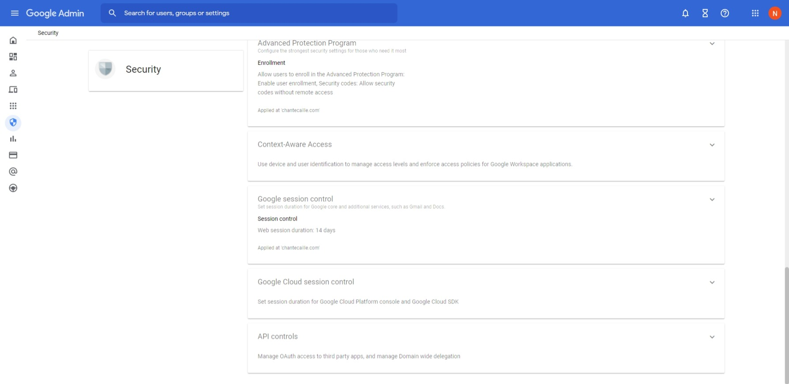

## Setup:

### If the GSuite account already has an Application and associated API:

Navigate to [Google Cloud Console](https://console.cloud.google.com/)  
Log in as a user with appropriate priveleges

From the top bar select the organization and the application with the API.

Open the menu in the top left and find APIs and Services then navigate to Credentials

Under the OAuth 2.0 Client IDs you will see the Credentials. On the right side there will be a download icon. Click it

A pop up will allow you to download the credentials. Put this file into the same directory as the `script.py` file and rename it to `credentials.json`

### If setting up the GSuite Application and API from scratch:

Refer to this guide to setup your environment:
https://developers.google.com/admin-sdk/directory/v1/quickstart/python

Create a project and enable the API:
https://developers.google.com/workspace/guides/create-project

Create credentials:
https://developers.google.com/workspace/guides/create-credentials

Make sure to download the Credentials as a JSON file when prompted and put the JSON file into the directory and rename it to "credentials.json"

### For both scratch and already setup environments, make sure to:

#### Set the API Control settings to trust iternal, domain owned apps

Log into [Google Admin](admin.google.com/) and navigate to the Security tab. Scroll to the bottom and you will find the API controls.

Set the API controls to trust internal, domain owned apps

#### Add the Admin SDK API to the project

From the Google Cloud Platform dashboard you should be able to simply search at the top for "Admin SDK API" and add it to the application if it isnt already.

## Use:

run this to download all necessary packages:
`pip install -r requirements.txt`

To use, simply run the script in your favorite IDE.
A browser tab will open asking you to login to a google account with the appropriate priveleges to access the Google Directory API.
A token will then be generated and placed in the same directory as `script.py` and will be used for authentication instead of a browser tab.

## Result:

The script will dump two files. One called "ListOfGroups.csv" and one called "GroupsAndMembersList.csv".

## Shoutout to:

[naseemkullah](https://github.com/naseemkullah/google-group-members-list-python)

[jmathai-google](https://github.com/jmathai-google/all-groups-in-customer)
